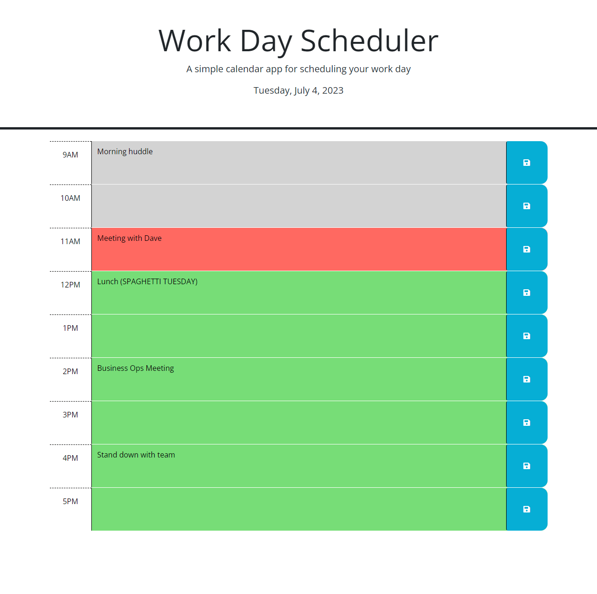

# Workday Scheduler
This repository holds the code for my Workday Scheduler application.

## Description
This application is a scheduler that you can add events to. Events will be saved for future visits.

## Usage

Click empty space on any of the hour timeblocks and enter any events you wish. When done, you can click the save button on the right side of each block to save that block's notes for future visits to the application.

The Workday Scheduler can be accessed via GitHub Pages [HERE](https://hdavis147.github.io/Javascript-Quiz/).

## Credits

Starter code provided by edX Bootcamps. Javascript written by me.

## License

[MIT License](./LICENSE)
